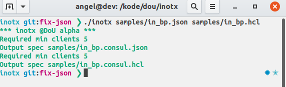

### Experimental repo 
The idea is to import a json/hcl config with the mapping of load balancers per service
and translate it to a new picture with consul instead the LB. 

#### sample inputs 
-> samples/input.json

#### sample usage

input:
  ./inotx <initial_blue_print>.json|hcl
output:
  <initial_blue_print>consul.json|hcl

#### Pending items
-> Firewall rules and single instance
-> Integration with Polo's code
-> Connection with azure backend to feed
-> Plugin for vscode

WIP
